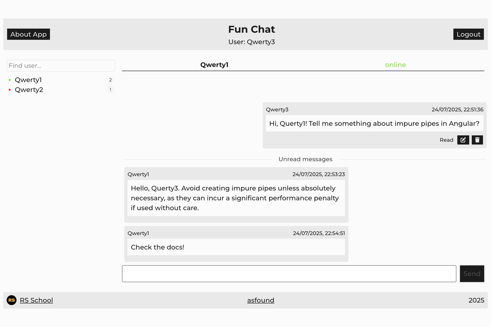

#  Fun Chat

**Fun Chat** is a single-page chat application built on WebSocket. It features user authentication, private messaging, message delivery/read statuses, message editing and deletion, and a responsive user interface. It uses a ready-made backend server provided separately.

**Rolling Scopes School Task** — Stage 2: [Fun Chat](https://github.com/rolling-scopes-school/tasks/tree/master/stage2/tasks/fun-chat)


## Demo



##  Local Setup


   ```bash
   git clone https://github.com/asfound/fun-chat.git
   npm install
   npm run dev
